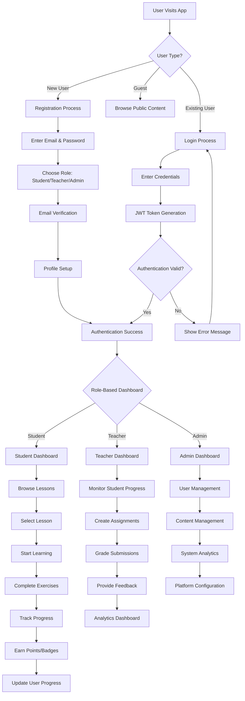
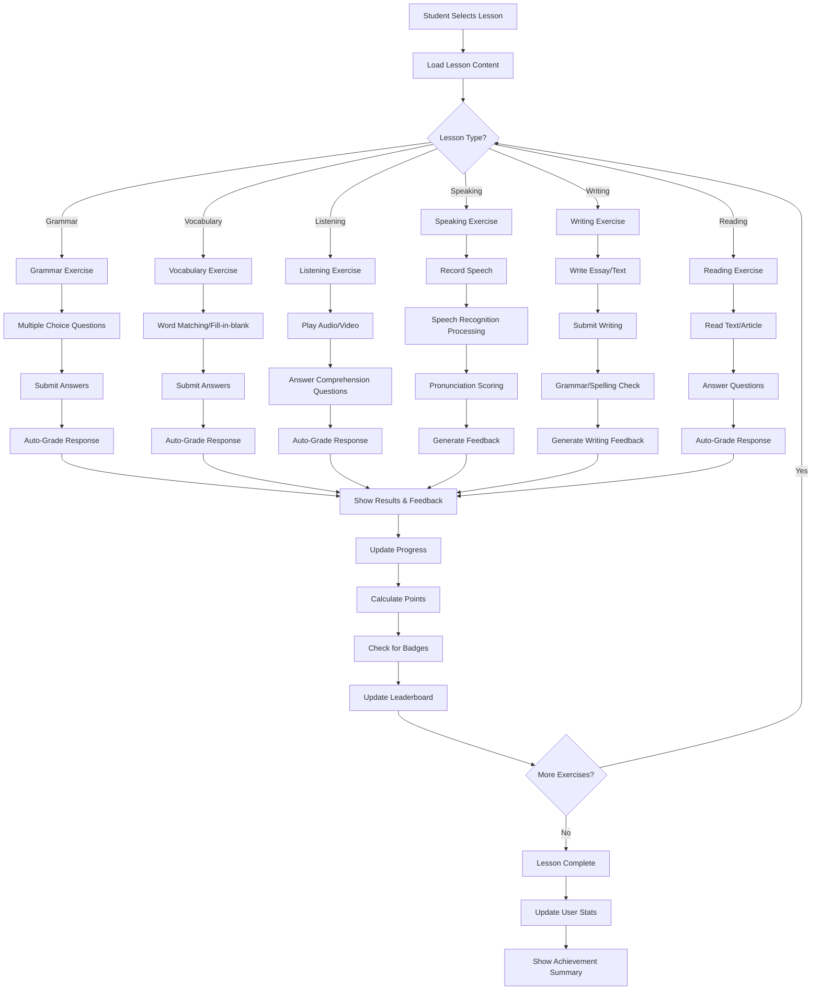
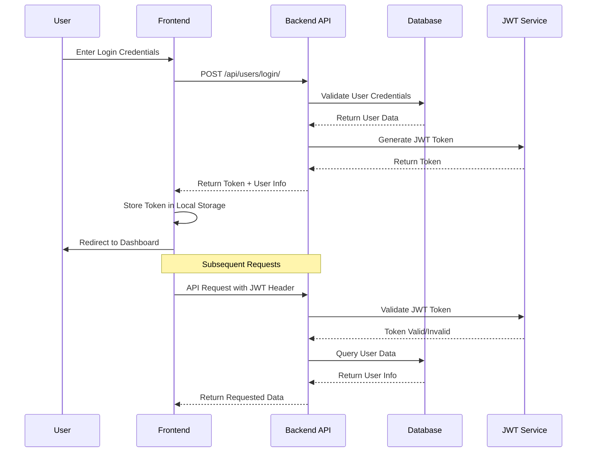
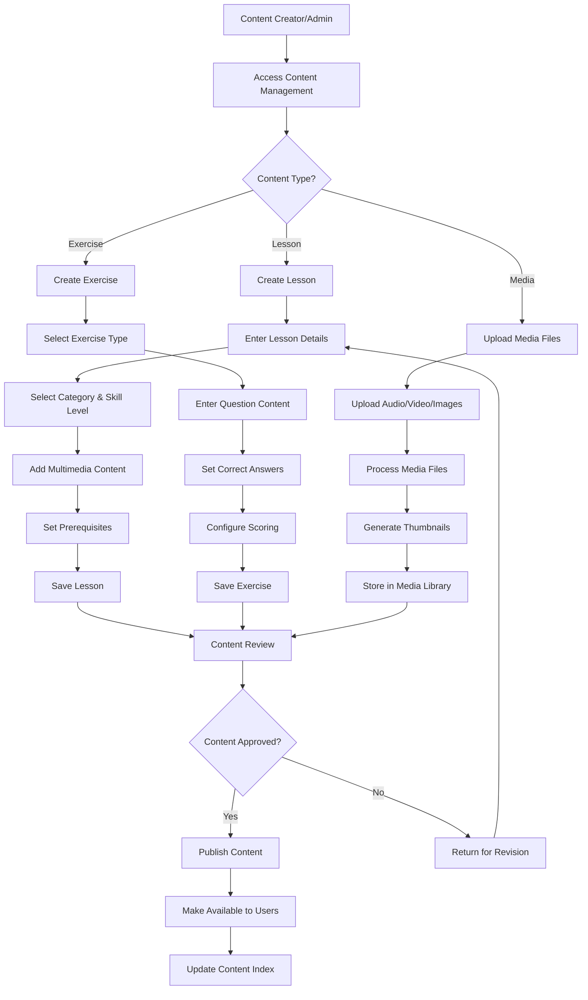
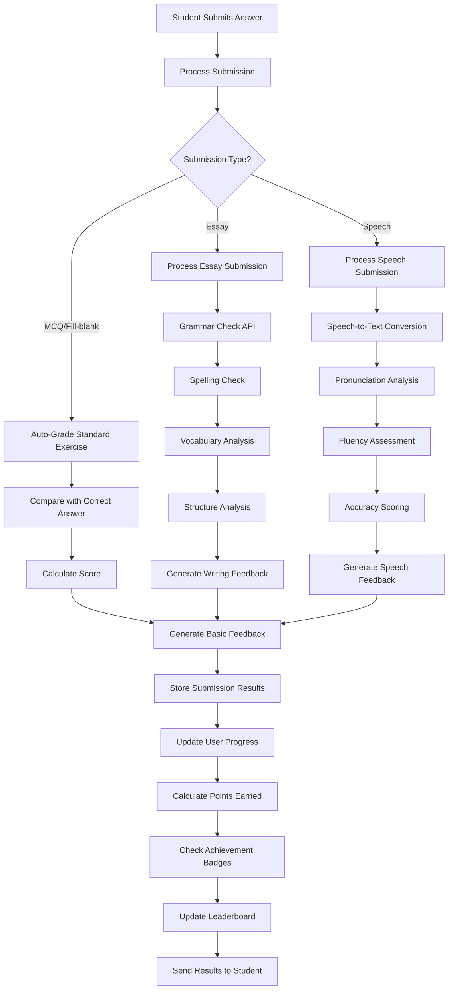
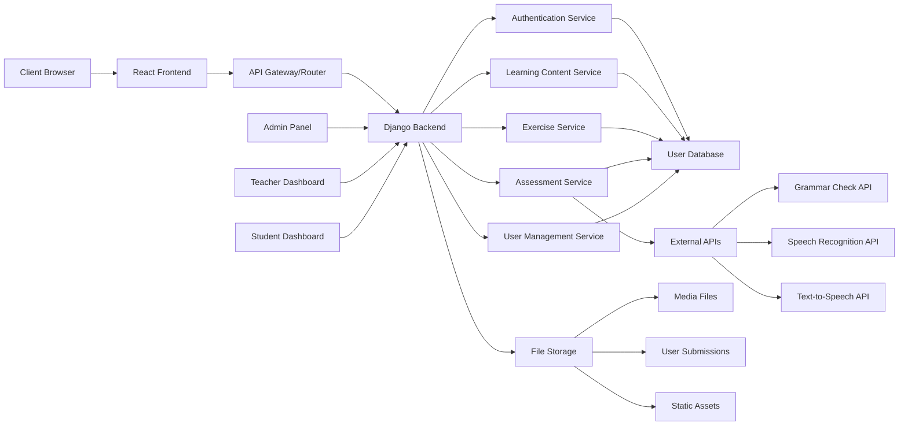

# English Learning App - Process Model Diagram

## Overall System Process Flow

## Detailed Learning Process Flow

## User Authentication & Authorization Process

## Content Management Process Flow

## Assessment & Feedback Process

## System Architecture Process

## Key Process Components:

### 1. **User Onboarding Process**
- Registration → Email Verification → Role Selection → Profile Setup → Dashboard Access

### 2. **Learning Process**
- Lesson Selection → Content Consumption → Exercise Completion → Assessment → Progress Tracking

### 3. **Assessment Process**
- Answer Submission → Automated Grading → Feedback Generation → Score Calculation → Progress Update

### 4. **Content Management Process**
- Content Creation → Review → Approval → Publishing → Distribution

### 5. **System Integration Process**
- Frontend-Backend Communication → Database Operations → External API Integration → Real-time Updates

This process model demonstrates the comprehensive workflow of your English Learning App, showing how users interact with the system, how content flows through the platform, and how assessments are processed automatically.